# LangChain Messages: Complete Implementation Guide

## Learning Objectives

By the end of this lesson, you will:

- 💬 **Understand message types** and their roles in LLM conversations
- 🏗️ **Build production-ready message systems** using enterprise patterns
- 🖼️ **Work with multimodal content** (images, audio, video, documents)
- 🔄 **Manage conversation history** and context effectively
- 📊 **Track token usage** and calculate costs
- 🛠️ **Parse and transform messages** for various use cases
- 🧪 **Write comprehensive tests** for message handling
- 🚀 **Deploy scalable solutions** with proper validation

## What Are Messages?

Messages are the fundamental units of communication between you and an LLM. They represent:

- **Context**: System instructions, conversation history
- **Input**: User questions and requests
- **Output**: AI responses and tool results
- **Content**: Text, images, audio, video, documents

In LangChain, messages are typed objects that carry:
- **Role** - Who sent the message (system, user, assistant, tool)
- **Content** - The actual message data (text, multimodal blocks)
- **Metadata** - Additional information (IDs, usage stats, timestamps)

## Architecture Overview

Our message system follows clean architecture with separation of concerns:

```mermaid
graph TB
    subgraph "🏭 Builder Layer"
        MB[MessageBuilder]
        MMB[MultimodalMessageBuilder]
    end

    subgraph "🔍 Parser Layer"
        MP[MessageParser]
    end

    subgraph "⚙️ Service Layer"
        MS[MessageService]
        CH[ConversationHistory]
    end

    subgraph "🛠️ Configuration"
        CONST[Constants]
        PRICING[Token Pricing]
    end

    subgraph "📦 Message Types"
        SYS[SystemMessage]
        HUM[HumanMessage]
        AI[AIMessage]
        TOOL[ToolMessage]
    end

    MB --> SYS
    MB --> HUM
    MB --> AI
    MB --> TOOL
    MMB --> HUM
    MP --> MB
    MS --> MB
    MS --> MP
    CH --> MB
    CH --> MP
    MS --> CONST
    MS --> PRICING

    classDef builder fill:#e1f5fe,stroke:#0277bd,color:#01579b
    classDef parser fill:#f3e5f5,stroke:#7b1fa2,color:#4a148c
    classDef service fill:#e8f5e8,stroke:#388e3c,color:#1b5e20
    classDef config fill:#fff3e0,stroke:#f57c00,color:#e65100
    classDef types fill:#fce4ec,stroke:#c2185b,color:#880e4f

    class MB,MMB builder
    class MP parser
    class MS,CH service
    class CONST,PRICING config
    class SYS,HUM,AI,TOOL types
```



## Message Types

### 1. System Message

**Purpose**: Provide instructions and context to the model

```typescript
import { MessageBuilder } from "./core/index.js";

// Basic system prompt
const systemMsg = MessageBuilder.system(
  "You are a helpful AI assistant that provides concise answers."
);

// Detailed persona
const detailedSystem = MessageBuilder.system(`
You are a senior TypeScript developer with expertise in:
- Clean architecture patterns
- Test-driven development
- Performance optimization

Always:
- Provide code examples
- Explain your reasoning
- Be concise but thorough
`);
```

**Key Points**:
- Should appear at the beginning of conversations
- Sets behavior and tone for the entire interaction
- Can include constraints, format requirements, expertise areas

### 2. Human Message

**Purpose**: Represent user input and questions

```typescript
// Simple text message
const humanMsg = MessageBuilder.human("What is the capital of France?");

// Message with metadata
const humanWithMeta = MessageBuilder.humanWithMetadata(
  "Hello, my name is Alice",
  {
    name: "alice",
    id: "msg_123",
    timestamp: Date.now()
  }
);

// Multimodal message
const multimodalMsg = MessageBuilder.withImage(
  "Describe what you see in this image",
  "https://example.com/image.jpg"
);
```

**Metadata Fields**:
- `name` - User identifier (varies by provider)
- `id` - Unique message identifier
- Custom fields for tracking and organization

### 3. AI Message

**Purpose**: Represent model responses

```typescript
// Simple response
const aiMsg = MessageBuilder.ai("The capital of France is Paris.");

// Response with tool calls (handled by model)
const aiWithTools = new AIMessage({
  content: "",
  tool_calls: [
    {
      name: "get_weather",
      args: { location: "Paris" },
      id: "call_123"
    }
  ]
});
```

**AIMessage Attributes**:
- `content` - Text or multimodal response
- `tool_calls` - Tool invocations made by model
- `usage_metadata` - Token counts and usage data
- `response_metadata` - Provider-specific data
- `id` - Unique identifier

### 4. Tool Message

**Purpose**: Provide tool execution results back to the model

```typescript
// Simple tool result
const toolMsg = MessageBuilder.tool(
  "Temperature: 72°F, Conditions: Sunny",
  "call_123",  // Matches tool call ID
  "get_weather"
);

// Tool result with artifact
const toolWithArtifact = MessageBuilder.toolWithArtifact(
  "The theory of relativity was developed by Einstein in 1905...",
  "call_456",
  "search_documents",
  {
    document_id: "doc_789",
    page: 1,
    relevance_score: 0.95,
    source: "research_paper.pdf"
  }
);
```

**Artifact Field**:
- Stores supplementary data not sent to the model
- Useful for document IDs, metadata, debugging info
- Accessible programmatically for downstream processing

## Core Implementation

### MessageBuilder - Factory Pattern

**Purpose**: Consistent message creation with validation

```typescript
export class MessageBuilder {
  /**
   * Create system message with instructions
   */
  static system(content: string): SystemMessage {
    return new SystemMessage(content);
  }

  /**
   * Create human message (user input)
   */
  static human(content: string): HumanMessage {
    return new HumanMessage(content);
  }

  /**
   * Create human message with metadata
   */
  static humanWithMetadata(
    content: string,
    metadata: { name?: string; id?: string; [key: string]: any }
  ): HumanMessage {
    return new HumanMessage({ content, ...metadata });
  }

  /**
   * Create AI message (assistant response)
   */
  static ai(content: string): AIMessage {
    return new AIMessage(content);
  }

  /**
   * Create a conversation from role/content pairs
   */
  static conversation(
    messages: Array<{ role: "system" | "user" | "assistant"; content: string }>
  ): BaseMessage[] {
    return messages.map(({ role, content }) => {
      switch (role) {
        case "system":
          return this.system(content);
        case "user":
          return this.human(content);
        case "assistant":
          return this.ai(content);
        default:
          throw new Error(`Unknown role: ${role}`);
      }
    });
  }
}
```

### MessageParser - Extraction and Analysis

**Purpose**: Parse and extract data from messages

```typescript
export class MessageParser {
  /**
   * Extract text content from any message
   */
  static extractText(message: BaseMessage): string {
    if (typeof message.content === "string") {
      return message.content;
    }

    if (Array.isArray(message.content)) {
      const textBlocks = message.content
        .filter((block: any) => block.type === "text")
        .map((block: any) => block.text);

      return textBlocks.join("\n");
    }

    return "";
  }

  /**
   * Extract content blocks from message
   */
  static extractContentBlocks(message: BaseMessage): ParsedContentBlock[] {
    if (typeof message.content === "string") {
      return [{ type: "text", text: message.content }];
    }

    if (Array.isArray(message.content)) {
      return message.content.map((block: any) => this.parseContentBlock(block));
    }

    return [];
  }

  /**
   * Check if message contains multimodal content
   */
  static isMultimodal(message: BaseMessage): boolean {
    if (typeof message.content === "string") {
      return false;
    }

    if (Array.isArray(message.content)) {
      return message.content.some(
        (block: any) =>
          block.type === "image" ||
          block.type === "audio" ||
          block.type === "video" ||
          block.type === "file"
      );
    }

    return false;
  }

  /**
   * Extract usage metadata from AI message
   */
  static extractUsageMetadata(message: AIMessage): UsageMetadata | null {
    if (!message.usage_metadata) {
      return null;
    }

    return {
      input_tokens: message.usage_metadata.input_tokens || 0,
      output_tokens: message.usage_metadata.output_tokens || 0,
      total_tokens: message.usage_metadata.total_tokens || 0,
      input_token_details: message.usage_metadata.input_token_details,
      output_token_details: message.usage_metadata.output_token_details
    };
  }
}
```

### MessageService - High-Level Operations

**Purpose**: Business logic for conversation management

```typescript
export class MessageService {
  /**
   * Create conversation from exchanges
   */
  static createConversation(
    exchanges: Array<{ user: string; assistant: string }>,
    systemPrompt?: string
  ): BaseMessage[] {
    const messages: BaseMessage[] = [];

    if (systemPrompt) {
      messages.push(MessageBuilder.system(systemPrompt));
    }

    exchanges.forEach(({ user, assistant }) => {
      messages.push(MessageBuilder.human(user));
      messages.push(MessageBuilder.ai(assistant));
    });

    return messages;
  }

  /**
   * Get recent conversation context
   */
  static getRecentContext(
    messages: BaseMessage[],
    numExchanges: number = 5
  ): BaseMessage[] {
    // Keep system messages
    const systemMessages = messages.filter(
      (msg) => MessageParser.getMessageType(msg) === "system"
    );

    // Get last N exchanges
    const otherMessages = messages.filter(
      (msg) => MessageParser.getMessageType(msg) !== "system"
    );

    const recentMessages = otherMessages.slice(-numExchanges * 2);

    return [...systemMessages, ...recentMessages];
  }

  /**
   * Truncate conversation to fit token limit
   */
  static truncateToTokenLimit(
    messages: BaseMessage[],
    maxTokens: number
  ): BaseMessage[] {
    // Keep system messages
    const systemMessages = messages.filter(
      (msg) => MessageParser.getMessageType(msg) === "system"
    );

    const otherMessages = messages.filter(
      (msg) => MessageParser.getMessageType(msg) !== "system"
    );

    // Estimate system message tokens
    const systemTokens = this.estimateTokens(systemMessages);
    const availableTokens = maxTokens - systemTokens;

    // Add messages from end until we hit limit
    const truncated: BaseMessage[] = [];
    let currentTokens = 0;

    for (let i = otherMessages.length - 1; i >= 0; i--) {
      const msg = otherMessages[i];
      const msgTokens = this.estimateTokens([msg]);

      if (currentTokens + msgTokens <= availableTokens) {
        truncated.unshift(msg);
        currentTokens += msgTokens;
      } else {
        break;
      }
    }

    return [...systemMessages, ...truncated];
  }

  /**
   * Estimate tokens (1 token ≈ 4 characters)
   */
  static estimateTokens(messages: BaseMessage[]): number {
    const text = this.extractAllText(messages);
    return Math.ceil(text.length / 4);
  }
}
```

### ConversationHistory - State Management

**Purpose**: Manage conversation state with automatic trimming

```typescript
export class ConversationHistory {
  private messages: BaseMessage[] = [];
  private maxMessages?: number;

  constructor(initialMessages: BaseMessage[] = [], maxMessages?: number) {
    this.messages = [...initialMessages];
    this.maxMessages = maxMessages;
  }

  /**
   * Add message to history
   */
  add(message: BaseMessage): void {
    this.messages.push(message);
    this.trim();
  }

  /**
   * Get all messages
   */
  getAll(): BaseMessage[] {
    return [...this.messages];
  }

  /**
   * Get last N messages
   */
  getLast(n: number): BaseMessage[] {
    return this.messages.slice(-n);
  }

  /**
   * Get messages by type
   */
  getByType(type: "system" | "human" | "ai" | "tool"): BaseMessage[] {
    return MessageParser.filterByType(this.messages, type);
  }

  /**
   * Trim to max length, keeping system messages
   */
  private trim(): void {
    if (this.maxMessages && this.messages.length > this.maxMessages) {
      const systemMessages = this.messages.filter(
        (msg) => MessageParser.getMessageType(msg) === "system"
      );

      const otherMessages = this.messages.filter(
        (msg) => MessageParser.getMessageType(msg) !== "system"
      );

      const trimmedOther = otherMessages.slice(-this.maxMessages + systemMessages.length);
      this.messages = [...systemMessages, ...trimmedOther];
    }
  }

  /**
   * Get total token usage
   */
  getTotalUsage(): UsageMetadata {
    return MessageParser.calculateTotalTokens(this.messages);
  }
}
```

## Multimodal Messages

### Images

```typescript
// From URL
const imageMsg = MessageBuilder.withImage(
  "Describe what you see in this image",
  "https://example.com/photo.jpg"
);

// From base64 data
const base64Msg = MessageBuilder.withImageData(
  "What color is this?",
  "iVBORw0KGgo...", // base64 string
  MIME_TYPES.IMAGE_PNG
);

// Using MultimodalMessageBuilder
const multiMsg = new MultimodalMessageBuilder()
  .addText("Please analyze these:")
  .addImageUrl("https://example.com/chart1.png")
  .addImageUrl("https://example.com/chart2.png")
  .build();
```

**Supported Formats**:
- JPEG (`image/jpeg`)
- PNG (`image/png`)
- GIF (`image/gif`)
- WebP (`image/webp`)

### Documents

```typescript
// PDF from URL
const pdfMsg = MessageBuilder.withPDF(
  "Summarize this document",
  "https://example.com/report.pdf"
);

// With builder
const docMsg = new MultimodalMessageBuilder()
  .addText("Review these documents:")
  .addPDF("https://example.com/report.pdf", "Q4_Report.pdf")
  .addPDF("https://example.com/analysis.pdf", "Analysis.pdf")
  .build();
```

**Supported Formats**:
- PDF (`application/pdf`)
- Plain text (`text/plain`)
- Markdown (`text/markdown`)

### Audio

```typescript
const audioMsg = MessageBuilder.withAudio(
  "Transcribe this audio",
  "base64audiodata...",
  MIME_TYPES.AUDIO_MPEG
);

// With builder
const audioMulti = new MultimodalMessageBuilder()
  .addText("Process this audio:")
  .addAudio("base64data...", MIME_TYPES.AUDIO_WAV)
  .build();
```

**Supported Formats**:
- MP3 (`audio/mpeg`)
- WAV (`audio/wav`)
- OGG (`audio/ogg`)
- WebM Audio (`audio/webm`)

### Video

```typescript
const videoMsg = new MultimodalMessageBuilder()
  .addText("Describe this video:")
  .addVideo("base64videodata...", MIME_TYPES.VIDEO_MP4)
  .build();
```

**Supported Formats**:
- MP4 (`video/mp4`)
- WebM (`video/webm`)
- OGG (`video/ogg`)

### Content Block Structure

```typescript
// Text block
{
  type: "text",
  text: "Hello world"
}

// Image block
{
  type: "image",
  source_type: "url",  // or "base64" or "id"
  url: "https://example.com/img.jpg",
  mimeType: "image/jpeg"
}

// Audio block
{
  type: "audio",
  source_type: "base64",
  data: "base64string...",
  mimeType: "audio/mpeg"
}

// File block
{
  type: "file",
  source_type: "url",
  url: "https://example.com/doc.pdf",
  mimeType: "application/pdf",
  filename: "document.pdf"
}
```

## Token Usage and Costs

### Tracking Token Usage

```typescript
import { MessageParser, calculateCost } from "./index.js";

// From AI message response
const response: AIMessage = await model.invoke(messages);

const usage = MessageParser.extractUsageMetadata(response);

if (usage) {
  console.log(`Input tokens: ${usage.input_tokens}`);
  console.log(`Output tokens: ${usage.output_tokens}`);
  console.log(`Total tokens: ${usage.total_tokens}`);

  // Detailed breakdown
  if (usage.input_token_details?.cache_read) {
    console.log(`Cache hits: ${usage.input_token_details.cache_read}`);
  }

  if (usage.output_token_details?.reasoning) {
    console.log(`Reasoning tokens: ${usage.output_token_details.reasoning}`);
  }
}
```

### Cost Calculation

```typescript
import { calculateCost } from "./config/index.js";

const usage = MessageParser.extractUsageMetadata(response);

if (usage) {
  const cost = calculateCost(
    usage.input_tokens,
    usage.output_tokens,
    "gpt-4o-mini"
  );

  console.log(`Input cost: $${cost.inputCost.toFixed(6)}`);
  console.log(`Output cost: $${cost.outputCost.toFixed(6)}`);
  console.log(`Total cost: $${cost.totalCost.toFixed(6)}`);
}
```

### Estimating Costs Before Calling

```typescript
import { MessageService } from "./core/index.js";

const messages = [
  MessageBuilder.system("You are helpful"),
  MessageBuilder.human("Long question here...")
];

// Estimate tokens (rough approximation)
const estimatedTokens = MessageService.estimateTokens(messages);

console.log(`Estimated tokens: ${estimatedTokens}`);

// Calculate estimated cost
const estimatedCost = calculateCost(
  estimatedTokens * 0.6,  // Assume 60% input
  estimatedTokens * 0.4,  // Assume 40% output
  "gpt-4o-mini"
);

console.log(`Estimated cost: $${estimatedCost.totalCost.toFixed(6)}`);
```

### Tracking Conversation Costs

```typescript
const history = new ConversationHistory();

// Add messages throughout conversation
history.add(humanMsg);
history.add(aiResponse1);
history.add(humanMsg2);
history.add(aiResponse2);

// Get total usage
const totalUsage = history.getTotalUsage();
const totalCost = calculateCost(
  totalUsage.input_tokens,
  totalUsage.output_tokens,
  "gpt-4o-mini"
);

console.log(`Total conversation cost: $${totalCost.totalCost.toFixed(4)}`);
```

## Message Transformations

### Format Conversion

```typescript
// To OpenAI chat format
const messages = MessageBuilder.conversation([
  { role: "system", content: "Be helpful" },
  { role: "user", content: "Hello" },
  { role: "assistant", content: "Hi!" }
]);

const chatFormat = MessageService.toChatFormat(messages);
// [
//   { role: "system", content: "Be helpful" },
//   { role: "user", content: "Hello" },
//   { role: "assistant", content: "Hi!" }
// ]
```

### Merging Consecutive Messages

```typescript
const messages = [
  MessageBuilder.human("Hello"),
  MessageBuilder.human("How are you?"),
  MessageBuilder.ai("I'm good"),
  MessageBuilder.ai("Thanks for asking")
];

const merged = MessageService.mergeConsecutive(messages);
// Results in 2 messages with combined content
```

### Extracting Text

```typescript
// From single message
const text = MessageParser.extractText(message);

// From all messages
const allText = MessageService.extractAllText(messages);
```

### Filtering Messages

```typescript
// By type
const humanOnly = MessageParser.filterByType(messages, "human");
const aiOnly = MessageParser.filterByType(messages, "ai");

// Filter out type
const withoutSystem = MessageService.filterOut(messages, "system");
```

## Validation

### Sequence Validation

```typescript
const messages = [
  MessageBuilder.human("Hello"),
  MessageBuilder.system("Be helpful"), // ERROR: System should be first
  MessageBuilder.ai("Hi")
];

const errors = MessageService.validateSequence(messages);

if (errors.length > 0) {
  console.error("Validation errors:", errors);
  // ["System messages should appear at the beginning"]
}
```

### Content Validation

```typescript
import { VALIDATION_RULES } from "./config/index.js";

// Check text length
const text = MessageParser.extractText(message);

if (text.length < VALIDATION_RULES.minTextLength) {
  console.error("Message too short");
}

if (text.length > VALIDATION_RULES.maxTextLength) {
  console.error("Message too long");
}

// Check content blocks
const blocks = MessageParser.extractContentBlocks(message);

if (blocks.length > VALIDATION_RULES.maxContentBlocks) {
  console.error("Too many content blocks");
}
```

## Best Practices

### ✅ Do's

1. **Always include system messages** for consistent behavior
   ```typescript
   const messages = [
     MessageBuilder.system("You are a helpful assistant"),
     MessageBuilder.human("Hello")
   ];
   ```

2. **Use ConversationHistory for state management**
   ```typescript
   const history = new ConversationHistory([], 50); // Max 50 messages
   history.add(message);
   ```

3. **Validate message sequences**
   ```typescript
   const errors = MessageService.validateSequence(messages);
   if (errors.length > 0) {
     // Handle errors
   }
   ```

4. **Track token usage and costs**
   ```typescript
   const usage = MessageParser.extractUsageMetadata(response);
   const cost = calculateCost(usage.input_tokens, usage.output_tokens, model);
   ```

5. **Use truncation for long conversations**
   ```typescript
   const truncated = MessageService.truncateToTokenLimit(messages, 4000);
   ```

### ❌ Don'ts

1. **Don't put system messages in the middle**
   ```typescript
   // ❌ Bad
   [human, system, ai]

   // ✅ Good
   [system, human, ai]
   ```

2. **Don't exceed token limits**
   ```typescript
   // ❌ Bad
   await model.invoke(veryLongConversation);

   // ✅ Good
   const truncated = MessageService.truncateToTokenLimit(messages, maxTokens);
   await model.invoke(truncated);
   ```

3. **Don't ignore multimodal size limits**
   ```typescript
   // ✅ Good
   if (imageSize > MESSAGE_CONFIG.maxContentSize.image) {
     console.error("Image too large");
   }
   ```

4. **Don't lose conversation context**
   ```typescript
   // ❌ Bad
   const last = messages[messages.length - 1];

   // ✅ Good
   const context = MessageService.getRecentContext(messages, 5);
   ```

## Production Checklist

- ✅ **Message validation** - Validate sequences and content
- ✅ **Error handling** - Graceful failure on invalid messages
- ✅ **Token tracking** - Monitor usage and costs
- ✅ **History management** - Automatic trimming and cleanup
- ✅ **Multimodal support** - Handle images, audio, video, documents
- ✅ **Type safety** - Full TypeScript coverage
- ✅ **Test coverage** - Comprehensive test suite
- ✅ **Cost monitoring** - Track and optimize API costs
- ✅ **Context management** - Prevent token limit errors

## Common Patterns

### 1. Chat Application

```typescript
const history = new ConversationHistory(
  [MessageBuilder.system("You are a helpful chatbot")],
  100
);

// User sends message
function handleUserMessage(text: string): void {
  history.add(MessageBuilder.human(text));

  // Get AI response
  const response = await model.invoke(history.getAll());
  history.add(response);

  // Track costs
  const usage = MessageParser.extractUsageMetadata(response);
  const cost = calculateCost(usage.input_tokens, usage.output_tokens, "gpt-4o-mini");
  logCost(cost);
}
```

### 2. Document Analysis

```typescript
const analysis = new MultimodalMessageBuilder()
  .addText("Please analyze these documents and provide a summary:")
  .addPDF("https://example.com/report.pdf", "Annual_Report.pdf")
  .addPDF("https://example.com/analysis.pdf", "Market_Analysis.pdf")
  .build();

const response = await model.invoke([
  MessageBuilder.system("You are a document analyst"),
  analysis
]);
```

### 3. Long Conversation Management

```typescript
const history = new ConversationHistory();

// After many exchanges...
if (MessageService.estimateTokens(history.getAll()) > 3000) {
  const truncated = MessageService.truncateToTokenLimit(
    history.getAll(),
    2000
  );

  // Continue with truncated history
  const response = await model.invoke(truncated);
}
```

## Conclusion

This implementation provides enterprise-grade message handling with:

- **Clean Architecture** - Separated builder, parser, and service layers
- **Type Safety** - Full TypeScript coverage with proper types
- **Multimodal Support** - Images, audio, video, documents
- **Conversation Management** - History, truncation, context
- **Cost Tracking** - Token usage and cost calculation
- **Validation** - Sequence and content validation
- **Production Ready** - Error handling, testing, optimization

The codebase serves as a foundation for building sophisticated conversational AI applications with proper message management, cost tracking, and scalability.

## Additional Resources

- [LangChain Messages Documentation](https://js.langchain.com/docs/concepts/messages)
- [OpenAI Message Format](https://platform.openai.com/docs/api-reference/chat)
- [Anthropic Messages API](https://docs.anthropic.com/claude/reference/messages_post)
- [Token Counting Best Practices](https://platform.openai.com/docs/guides/token-counting)
