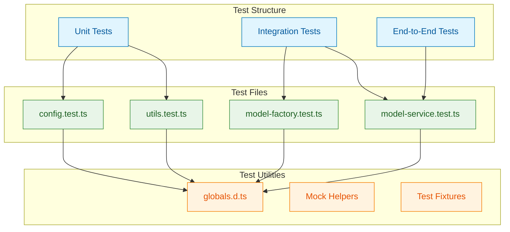

# Testing Guide for LangChain Models

## Overview

This document explains the testing strategy, setup, and best practices for testing the models lesson implementation. We use **Bun's native test runner** which provides a fast, integrated testing experience.

## Test Architecture



## Setup

### 1. TypeScript Configuration for Tests

The `globals.d.ts` file provides type definitions for Bun's test API:

```typescript
/// <reference types="bun-types" />

declare global {
  /**
   * Describe a test suite
   */
  function describe(name: string, fn: () => void): void;

  /**
   * Define a test case
   */
  function test(
    name: string,
    fn: () => void | Promise<void>,
    timeout?: number
  ): void;

  /**
   * Run code before all tests in a describe block
   */
  function beforeAll(fn: () => void | Promise<void>): void;

  /**
   * Run code after all tests in a describe block
   */
  function afterAll(fn: () => void | Promise<void>): void;

  /**
   * Run code before each test in a describe block
   */
  function beforeEach(fn: () => void | Promise<void>): void;

  /**
   * Run code after each test in a describe block
   */
  function afterEach(fn: () => void | Promise<void>): void;

  /**
   * Expect assertions
   */
  namespace expect {
    interface Matchers<T> {
      toBe(expected: T): void;
      toEqual(expected: T): void;
      toBeDefined(): void;
      toBeUndefined(): void;
      toBeNull(): void;
      toBeTypeOf(expected: string): void;
      toHaveProperty(property: string): void;
      toContain(expected: string | any): void;
      toThrow(error?: string | RegExp | Error): void;
      toBeGreaterThan(expected: number): void;
      toBeLessThan(expected: number): void;
      toBeGreaterThanOrEqual(expected: number): void;
      toBeLessThanOrEqual(expected: number): void;
      toBeInstanceOf(expected: any): void;
      toHaveLength(expected: number): void;
      not: Matchers<T>;
    }
  }

  function expect<T>(actual: T): expect.Matchers<T>;
}

export {};
```

### 2. Running Tests

```bash
# Run all tests
bun test

# Run specific test file
bun test config.test.ts

# Run tests in watch mode
bun test --watch

# Run tests with coverage
bun test --coverage

# Run tests matching a pattern
bun test --filter "ModelFactory"
```

## Test Organization

### 1. Configuration Tests (`config.test.ts`)

**Purpose:** Validate configuration management and environment setup

```typescript
import { describe, test, expect } from "bun:test";
import {
  MODEL_CONFIG,
  MODEL_CAPABILITIES,
  validateEnv,
  isProviderConfigured,
  getAvailableProviders
} from "../config/index.js";

describe("Configuration", () => {
  describe("MODEL_CONFIG", () => {
    test("should have all required provider configs", () => {
      expect(MODEL_CONFIG.providers).toBeDefined();
      expect(MODEL_CONFIG.providers.OPENAI).toBe("openai");
      expect(MODEL_CONFIG.providers.ANTHROPIC).toBe("anthropic");
      expect(MODEL_CONFIG.providers.GOOGLE).toBe("google");
    });

    test("should have model definitions for each provider", () => {
      expect(MODEL_CONFIG.models.openai).toBeDefined();
      expect(MODEL_CONFIG.models.anthropic).toBeDefined();
      expect(MODEL_CONFIG.models.google).toBeDefined();

      expect(MODEL_CONFIG.models.openai.gpt4Mini).toBe("gpt-4o-mini");
    });

    test("should have parameter presets", () => {
      expect(MODEL_CONFIG.parameters.temperature).toBeDefined();
      expect(MODEL_CONFIG.parameters.temperature.creative).toBe(0.9);
      expect(MODEL_CONFIG.parameters.temperature.balanced).toBe(0.7);
      expect(MODEL_CONFIG.parameters.temperature.precise).toBe(0.3);
    });
  });

  describe("Environment Validation", () => {
    test("should validate required environment variables", () => {
      // Assumes OPENAI_API_KEY is set
      expect(() => validateEnv()).not.toThrow();
    });

    test("should detect configured providers", () => {
      const isOpenAIConfigured = isProviderConfigured("openai");
      expect(isOpenAIConfigured).toBe(true);
    });

    test("should list available providers", () => {
      const providers = getAvailableProviders();
      expect(providers).toContain("openai");
      expect(Array.isArray(providers)).toBe(true);
    });
  });

  describe("Model Capabilities", () => {
    test("should define capabilities for each model", () => {
      expect(MODEL_CAPABILITIES.openai).toBeDefined();
      expect(MODEL_CAPABILITIES.openai.supportsStreaming).toBe(true);
      expect(MODEL_CAPABILITIES.openai.supportsStructuredOutput).toBe(true);
    });
  });
});
```

### 2. Factory Tests (`model-factory.test.ts`)

**Purpose:** Test model creation, validation, and configuration

```typescript
import { describe, test, expect, beforeAll } from "bun:test";
import { ModelFactory } from "../core/model-factory.js";
import { MODEL_CONFIG } from "../config/index.js";
import { ChatOpenAI } from "@langchain/openai";

describe("ModelFactory", () => {
  describe("Model Creation", () => {
    test("should create OpenAI model with default configuration", async () => {
      const model = await ModelFactory.createModel({
        provider: MODEL_CONFIG.providers.OPENAI
      });

      expect(model).toBeDefined();
      expect(model).toBeInstanceOf(ChatOpenAI);
    });

    test("should create model with custom parameters", async () => {
      const model = await ModelFactory.createModel({
        provider: MODEL_CONFIG.providers.OPENAI,
        model: MODEL_CONFIG.models.openai.gpt4Mini,
        parameters: {
          temperature: 0.5,
          maxTokens: 100
        }
      });

      expect(model).toBeDefined();
      // Note: Parameter values are internal to the model instance
    });

    test("should create model with specific model name", async () => {
      const model = await ModelFactory.createModel({
        model: MODEL_CONFIG.models.openai.gpt4Mini
      });

      expect(model).toBeDefined();
    });

    test("should throw error for unsupported provider", async () => {
      expect(async () => {
        await ModelFactory.createModel({
          provider: "unsupported-provider" as any
        });
      }).toThrow();
    });
  });

  describe("Multiple Model Creation", () => {
    test("should create multiple models with different configs", async () => {
      const configs = [
        {
          model: MODEL_CONFIG.models.openai.gpt4Mini,
          parameters: { temperature: 0.1 }
        },
        {
          model: MODEL_CONFIG.models.openai.gpt4Mini,
          parameters: { temperature: 0.9 }
        }
      ];

      const models = await ModelFactory.createMultipleModels(configs);

      expect(models).toHaveLength(2);
      expect(models[0]).toBeDefined();
      expect(models[1]).toBeDefined();
      expect(models[0]).toBeInstanceOf(ChatOpenAI);
      expect(models[1]).toBeInstanceOf(ChatOpenAI);
    });

    test("should handle empty config array", async () => {
      const models = await ModelFactory.createMultipleModels([]);
      expect(models).toHaveLength(0);
    });
  });

  describe("Environment Validation", () => {
    test("should validate environment on model creation", async () => {
      // Store original
      const originalKey = process.env.OPENAI_API_KEY;

      // Remove key
      delete process.env.OPENAI_API_KEY;

      // Should throw
      await expect(async () => {
        await ModelFactory.createModel({});
      }).toThrow();

      // Restore
      process.env.OPENAI_API_KEY = originalKey;
    });
  });
});
```

### 3. Service Tests (`model-service.test.ts`)

**Purpose:** Test service layer operations and business logic

```typescript
import { describe, test, expect, beforeAll } from "bun:test";
import { ModelFactory } from "../core/model-factory.js";
import { ModelService } from "../core/model-service.js";
import { MODEL_CONFIG } from "../config/index.js";

describe("ModelService", () => {
  let service: ModelService;

  beforeAll(async () => {
    const model = await ModelFactory.createModel({
      model: MODEL_CONFIG.models.openai.gpt4Mini,
      parameters: { temperature: 0.3 } // Lower temperature for consistent tests
    });
    service = new ModelService(model);
  });

  describe("Text Generation", () => {
    test("should generate text from simple prompt", async () => {
      const response = await service.generateText(
        "Say 'Hello' and nothing else"
      );

      expect(response).toBeDefined();
      expect(typeof response).toBe("string");
      expect(response.length).toBeGreaterThan(0);
    }, 15000);

    test("should handle long prompts", async () => {
      const longPrompt = "Explain ".repeat(100) + "quantum physics.";
      const response = await service.generateText(longPrompt);

      expect(response).toBeDefined();
      expect(response.length).toBeGreaterThan(0);
    }, 20000);

    test("should handle special characters", async () => {
      const response = await service.generateText(
        "Repeat this: @#$%^&*()"
      );

      expect(response).toBeDefined();
    }, 10000);
  });

  describe("Streaming", () => {
    test("should stream text with callbacks", async () => {
      let tokens: string[] = [];
      let completed = false;

      await service.streamText(
        "Count from 1 to 3",
        {
          onToken: (token) => tokens.push(token),
          onComplete: () => { completed = true; }
        }
      );

      expect(tokens.length).toBeGreaterThan(0);
      expect(completed).toBe(true);
    }, 15000);

    test("should handle streaming errors", async () => {
      let errorCaught = false;

      await service.streamText(
        "", // Empty prompt might cause issues
        {
          onToken: (token) => {},
          onError: (error) => { errorCaught = true; }
        }
      ).catch(() => {});

      // Test passes if we handled the error gracefully
      expect(true).toBe(true);
    }, 10000);
  });

  describe("Batch Processing", () => {
    test("should process multiple prompts in batch", async () => {
      const prompts = [
        "What is 1+1?",
        "What is 2+2?",
        "What is 3+3?"
      ];

      const responses = await service.batchGenerate(prompts, 3);

      expect(responses).toHaveLength(3);
      responses.forEach(response => {
        expect(response).toBeDefined();
        expect(typeof response).toBe("string");
      });
    }, 30000);

    test("should respect max concurrency", async () => {
      const prompts = Array(10).fill("Say hello");
      const startTime = Date.now();

      await service.batchGenerate(prompts, 2); // Max 2 concurrent

      const duration = Date.now() - startTime;

      // With concurrency=2, should take longer than parallel execution
      expect(duration).toBeGreaterThan(0);
    }, 60000);

    test("should handle empty batch", async () => {
      const responses = await service.batchGenerate([]);
      expect(responses).toHaveLength(0);
    });
  });

  describe("Structured Output", () => {
    test("should generate movie info with schema", async () => {
      const movieInfo = await service.generateMovieInfo("Inception");

      expect(movieInfo).toBeDefined();
      expect(movieInfo).toHaveProperty("title");
      expect(movieInfo).toHaveProperty("year");
      expect(movieInfo).toHaveProperty("director");
      expect(movieInfo).toHaveProperty("rating");

      expect(typeof movieInfo.title).toBe("string");
      expect(typeof movieInfo.year).toBe("number");
      expect(typeof movieInfo.rating).toBe("number");

      expect(movieInfo.rating).toBeGreaterThanOrEqual(0);
      expect(movieInfo.rating).toBeLessThanOrEqual(10);
    }, 15000);

    test("should classify text correctly", async () => {
      const result = await service.classifyText(
        "The new AI model shows impressive performance in benchmarks",
        ["Technology", "Sports", "Politics", "Entertainment"]
      );

      expect(result).toBeDefined();
      expect(result.category).toBe("Technology");
      expect(result.confidence).toBeGreaterThan(0);
      expect(result.confidence).toBeLessThanOrEqual(1);
      expect(typeof result.reasoning).toBe("string");
    }, 15000);

    test("should handle invalid movie title gracefully", async () => {
      const movieInfo = await service.generateMovieInfo(
        "NonExistentMovie12345XYZ"
      );

      // Should still return valid schema structure
      expect(movieInfo).toBeDefined();
      expect(movieInfo).toHaveProperty("title");
    }, 15000);
  });

  describe("Conversation", () => {
    test("should maintain conversation context", async () => {
      const messages = [
        { role: "system" as const, content: "You are a helpful assistant." },
        { role: "user" as const, content: "My name is Alice." }
      ];

      const response1 = await service.continueConversation(
        messages,
        "My name is Alice."
      );

      expect(response1).toBeDefined();

      messages.push({ role: "assistant" as const, content: response1 });
      messages.push({ role: "user" as const, content: "What is my name?" });

      const response2 = await service.continueConversation(
        messages.slice(0, -1),
        "What is my name?"
      );

      // Should remember the name
      expect(response2.toLowerCase()).toContain("alice");
    }, 20000);
  });
});
```

### 4. Utility Tests (`utils.test.ts`)

**Purpose:** Test utility functions like logging and parsing

```typescript
import { describe, test, expect, beforeEach } from "bun:test";
import { Logger } from "../utils/logger.js";
import { ResponseParser } from "../utils/response-parser.js";
import { AIMessage, HumanMessage } from "@langchain/core/messages";

describe("Logger", () => {
  beforeEach(() => {
    Logger.clearHistory();
  });

  test("should log messages with different levels", () => {
    Logger.debug("Debug message");
    Logger.info("Info message");
    Logger.warn("Warning message");
    Logger.error("Error message");

    const history = Logger.getHistory();
    expect(history).toHaveLength(4);
  });

  test("should include context in logs", () => {
    Logger.info("Test message", { userId: "123", action: "test" });

    const history = Logger.getHistory();
    const lastLog = history[history.length - 1];

    expect(lastLog.context).toBeDefined();
    expect(lastLog.context?.userId).toBe("123");
  });

  test("should generate performance summary", () => {
    Logger.info("Message 1");
    Logger.info("Message 2");
    Logger.error("Error 1");

    const summary = Logger.getPerformanceSummary();

    expect(summary.totalLogs).toBe(3);
    expect(summary.byLevel.info).toBe(2);
    expect(summary.byLevel.error).toBe(1);
    expect(summary.errorRate).toBeGreaterThan(0);
  });

  test("should clear history", () => {
    Logger.info("Test");
    expect(Logger.getHistory()).toHaveLength(1);

    Logger.clearHistory();
    expect(Logger.getHistory()).toHaveLength(0);
  });
});

describe("ResponseParser", () => {
  test("should extract content from string message", () => {
    const message = new AIMessage("Hello, world!");
    const content = ResponseParser.extractContent(message);

    expect(content).toBe("Hello, world!");
  });

  test("should extract content from array message", () => {
    const message = new AIMessage([
      { type: "text", text: "Part 1" },
      { type: "text", text: "Part 2" }
    ] as any);

    const content = ResponseParser.extractContent(message);

    expect(content).toContain("Part 1");
    expect(content).toContain("Part 2");
  });

  test("should handle empty content", () => {
    const message = new AIMessage("");
    const content = ResponseParser.extractContent(message);

    expect(content).toBe("");
  });
});
```

## Test Best Practices

### 1. Test Naming Conventions

```typescript
// ✅ Good: Descriptive, specific
test("should create OpenAI model with custom temperature parameter", async () => {
  // ...
});

// ❌ Bad: Vague, unclear
test("test model creation", async () => {
  // ...
});
```

### 2. Test Organization

```typescript
describe("ModelService", () => {
  // Group related tests
  describe("Text Generation", () => {
    test("should generate text from simple prompt", async () => {});
    test("should handle long prompts", async () => {});
  });

  describe("Streaming", () => {
    test("should stream text with callbacks", async () => {});
    test("should handle streaming errors", async () => {});
  });
});
```

### 3. Setup and Teardown

```typescript
describe("ModelService", () => {
  let service: ModelService;

  // Run once before all tests
  beforeAll(async () => {
    const model = await ModelFactory.createModel({});
    service = new ModelService(model);
  });

  // Run before each test
  beforeEach(() => {
    Logger.clearHistory();
  });

  // Run after each test
  afterEach(() => {
    // Cleanup
  });

  // Run once after all tests
  afterAll(() => {
    // Final cleanup
  });
});
```

### 4. Timeouts for API Calls

```typescript
// Increase timeout for API-dependent tests
test("should generate text from API", async () => {
  const response = await service.generateText("Hello");
  expect(response).toBeDefined();
}, 15000); // 15 second timeout
```

### 5. Error Testing

```typescript
test("should throw error for invalid provider", async () => {
  await expect(async () => {
    await ModelFactory.createModel({
      provider: "invalid" as any
    });
  }).toThrow();
});

test("should handle API errors gracefully", async () => {
  let errorCaught = false;

  try {
    await service.generateText("");
  } catch (error) {
    errorCaught = true;
    expect(error).toBeDefined();
  }

  // Either succeeds or fails gracefully
  expect(true).toBe(true);
});
```

### 6. Mocking External Dependencies

```typescript
// Mock environment variables
test("should validate environment", () => {
  const original = process.env.OPENAI_API_KEY;

  delete process.env.OPENAI_API_KEY;
  expect(() => validateEnv()).toThrow();

  process.env.OPENAI_API_KEY = original;
});
```

## Running Specific Tests

### Filter by Name

```bash
# Run only tests matching "ModelFactory"
bun test --filter "ModelFactory"

# Run only tests matching "should create"
bun test --filter "should create"
```

### Run Specific Files

```bash
# Run only factory tests
bun test model-factory.test.ts

# Run multiple specific files
bun test config.test.ts utils.test.ts
```

### Watch Mode

```bash
# Re-run tests on file changes
bun test --watch
```

## Coverage Reports

```bash
# Generate coverage report
bun test --coverage

# Coverage output shows:
# - Lines covered
# - Branches covered
# - Functions covered
# - Statements covered
```

## Common Test Patterns

### 1. Testing Async Operations

```typescript
test("should complete async operation", async () => {
  const result = await service.generateText("Hello");
  expect(result).toBeDefined();
}, 10000);
```

### 2. Testing Callbacks

```typescript
test("should call callback with results", async () => {
  let callbackCalled = false;
  let receivedData: any;

  await service.streamText("Hello", {
    onToken: (token) => {
      callbackCalled = true;
      receivedData = token;
    }
  });

  expect(callbackCalled).toBe(true);
  expect(receivedData).toBeDefined();
});
```

### 3. Testing Error Conditions

```typescript
test("should handle missing configuration", () => {
  expect(() => validateEnv()).toThrow(/Missing required/);
});
```

### 4. Testing Batches

```typescript
test("should process batch correctly", async () => {
  const inputs = ["A", "B", "C"];
  const outputs = await service.batchGenerate(inputs);

  expect(outputs).toHaveLength(inputs.length);
  outputs.forEach(output => {
    expect(output).toBeDefined();
  });
});
```

## Debugging Tests

### 1. Console Logging

```typescript
test("debug test", async () => {
  console.log("Starting test...");
  const result = await service.generateText("Hello");
  console.log("Result:", result);
  expect(result).toBeDefined();
});
```

### 2. Focused Tests

```typescript
// Run only this test
test.only("should run this test only", async () => {
  // ...
});

// Skip this test
test.skip("should skip this test", async () => {
  // ...
});
```

### 3. Inspecting Test Results

```bash
# Run with verbose output
bun test --verbose

# Show all console output
bun test --preload ./test-setup.ts
```

## Continuous Integration

### GitHub Actions Example

```yaml
name: Tests

on: [push, pull_request]

jobs:
  test:
    runs-on: ubuntu-latest

    steps:
      - uses: actions/checkout@v3

      - name: Setup Bun
        uses: oven-sh/setup-bun@v1

      - name: Install dependencies
        run: bun install

      - name: Run tests
        run: bun test
        env:
          OPENAI_API_KEY: ${{ secrets.OPENAI_API_KEY }}

      - name: Generate coverage
        run: bun test --coverage
```

## Test Metrics

### Coverage Goals

- **Lines**: > 80%
- **Branches**: > 75%
- **Functions**: > 80%
- **Statements**: > 80%

### Performance Goals

- Unit tests: < 100ms
- Integration tests: < 5s
- E2E tests: < 30s

## Troubleshooting

### Common Issues

1. **Timeout Errors**: Increase test timeout for API calls
2. **API Rate Limits**: Add delays between tests
3. **Environment Variables**: Ensure .env is loaded
4. **Type Errors**: Check globals.d.ts is referenced

### Solutions

```typescript
// Add delay between API calls
async function delay(ms: number) {
  return new Promise(resolve => setTimeout(resolve, ms));
}

test("with delay", async () => {
  await service.generateText("Test 1");
  await delay(1000); // Wait 1 second
  await service.generateText("Test 2");
});
```

## Conclusion

A comprehensive test suite ensures:

- ✅ **Reliability** - Code works as expected
- ✅ **Maintainability** - Safe refactoring
- ✅ **Documentation** - Tests show usage examples
- ✅ **Confidence** - Deploy with certainty
- ✅ **Quality** - Catch bugs early

Follow these practices to build robust, well-tested LangChain applications.
