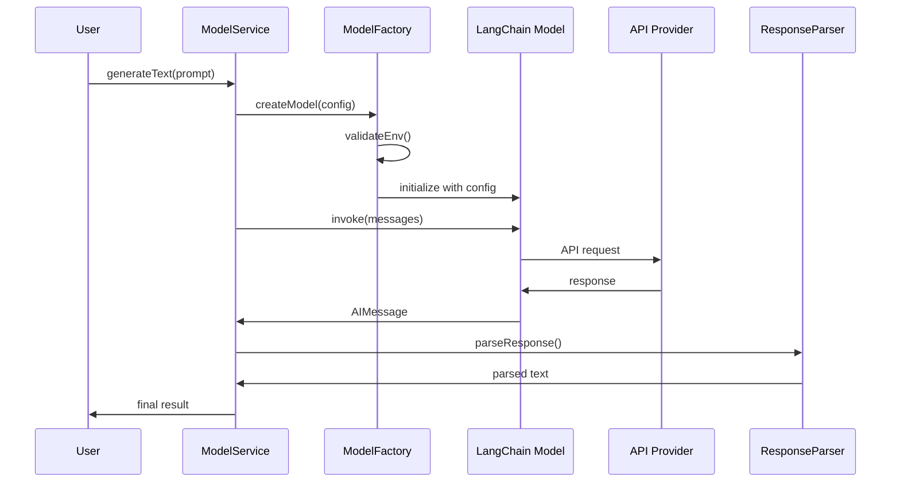

# LangChain Models: Complete Implementation Guide

## Learning Objectives

By the end of this lesson, you will:

- 🤖 **Understand chat models** and their role in AI applications
- 🏗️ **Build production-ready model integrations** using clean architecture patterns
- 🔧 **Master model invocation methods** (invoke, stream, batch)
- 🛠️ **Implement structured outputs** with Zod schema validation
- 📊 **Handle advanced features** like multimodal inputs, reasoning, and caching
- 🧪 **Write comprehensive tests** using Bun's native test runner
- 🚀 **Deploy scalable solutions** with factory and service patterns

## Architecture Overview

Our model system follows enterprise-grade architecture principles with clear separation of concerns:

```mermaid
graph TB
    subgraph "🏭 Factory Layer"
        MF[ModelFactory]
        MS[ModelService]
    end

    subgraph "⚙️ Configuration"
        CFG[Config/Constants]
        ENV[Environment Validation]
        SCHEMAS[Zod Schemas]
        PROVIDERS[Provider Config]
    end

    subgraph "🔧 Core Components"
        INVOKE[Invoke Methods]
        STREAM[Streaming]
        BATCH[Batch Processing]
        STRUCTURED[Structured Output]
    end

    subgraph "🛠️ Infrastructure"
        UTILS[Utilities]
        LOGGER[Logger]
        PARSER[ResponseParser]
    end

    subgraph "📚 Examples & Tests"
        EXAMPLES[Examples]
        TESTS[Test Suite]
    end

    MF --> CFG
    MF --> ENV
    MF --> PROVIDERS
    MS --> MF
    MS --> INVOKE
    MS --> STREAM
    MS --> BATCH
    MS --> STRUCTURED
    MS --> UTILS
    PARSER --> LOGGER
    TESTS --> MF
    TESTS --> MS
    EXAMPLES --> MS

    classDef factory fill:#e1f5fe,stroke:#0277bd,color:#01579b
    classDef config fill:#f3e5f5,stroke:#7b1fa2,color:#4a148c
    classDef core fill:#e8f5e8,stroke:#388e3c,color:#1b5e20
    classDef infra fill:#fff3e0,stroke:#f57c00,color:#e65100
    classDef examples fill:#fce4ec,stroke:#c2185b,color:#880e4f

    class MF,MS factory
    class CFG,ENV,SCHEMAS,PROVIDERS config
    class INVOKE,STREAM,BATCH,STRUCTURED core
    class UTILS,LOGGER,PARSER infra
    class EXAMPLES,TESTS examples
```



## Model Execution Flow

Understanding how models process requests through our architecture:



## Core Implementation

### 1. Configuration Management

**File Structure:**
```
config/
├── constants.ts   # Model configurations & parameters
├── env.ts        # Environment validation
├── index.ts      # Centralized exports
└── schemas.ts    # Zod schemas for structured outputs
```

**Key Implementation:**

```typescript
// config/constants.ts
export const MODEL_CONFIG = {
  providers: {
    OPENAI: "openai",
    ANTHROPIC: "anthropic",
    GOOGLE: "google",
    AZURE: "azure",
    BEDROCK: "bedrock"
  },
  models: {
    openai: {
      gpt4: "gpt-4",
      gpt4Turbo: "gpt-4-turbo-preview",
      gpt4Mini: "gpt-4o-mini"
    },
    anthropic: {
      claude3Opus: "claude-3-opus-20240229",
      claude3Sonnet: "claude-3-sonnet-20240229"
    },
    google: {
      geminiPro: "gemini-pro",
      gemini15Pro: "gemini-1.5-pro"
    }
  },
  parameters: {
    temperature: {
      creative: 0.9,
      balanced: 0.7,
      precise: 0.3,
      deterministic: 0
    },
    maxTokens: {
      short: 500,
      medium: 1000,
      long: 2000
    }
  }
} as const;
```

### 2. Environment Validation

**Purpose:** Fail fast on missing configuration

```typescript
// config/env.ts
export function validateEnv(): void {
  const requiredEnvVars = [
    "OPENAI_API_KEY",
    // Optional: "ANTHROPIC_API_KEY",
    // Optional: "GOOGLE_API_KEY"
  ];

  const missing = requiredEnvVars.filter((key) => !process.env[key]);

  if (missing.length > 0) {
    throw new Error(
      `Missing required environment variables: ${missing.join(", ")}\n` +
      `Please set them in your .env file.`
    );
  }
}

export function isProviderConfigured(provider: string): boolean {
  const providerKeys: Record<string, string> = {
    openai: "OPENAI_API_KEY",
    anthropic: "ANTHROPIC_API_KEY",
    google: "GOOGLE_API_KEY",
    azure: "AZURE_OPENAI_API_KEY",
    bedrock: "AWS_ACCESS_KEY_ID"
  };

  const key = providerKeys[provider.toLowerCase()];
  return key ? !!process.env[key] : false;
}
```

### 3. Factory Pattern Implementation

**Factory Benefits:**
- Consistent model creation
- Environment validation
- Configuration standardization
- Easy testing and mocking
- Provider abstraction

```typescript
// core/model-factory.ts
export class ModelFactory {
  /**
   * Create a chat model with specified configuration
   */
  static async createModel(options: ModelOptions): Promise<BaseChatModel> {
    // Validate environment before creating model
    validateEnv();

    const {
      provider = MODEL_CONFIG.providers.OPENAI,
      model,
      parameters = {}
    } = options;

    // Log model creation
    Logger.info("Creating model", { provider, model, parameters });

    // Provider-specific model creation
    switch (provider) {
      case MODEL_CONFIG.providers.OPENAI:
        return await this.createOpenAIModel(model, parameters);

      case MODEL_CONFIG.providers.ANTHROPIC:
        return await this.createAnthropicModel(model, parameters);

      case MODEL_CONFIG.providers.GOOGLE:
        return await this.createGoogleModel(model, parameters);

      default:
        throw new Error(`Unsupported provider: ${provider}`);
    }
  }

  /**
   * Create multiple models for comparison
   */
  static async createMultipleModels(
    configs: ModelOptions[]
  ): Promise<BaseChatModel[]> {
    return Promise.all(configs.map(config => this.createModel(config)));
  }

  private static async createOpenAIModel(
    model?: string,
    parameters?: ModelParameters
  ): Promise<ChatOpenAI> {
    const { ChatOpenAI } = await import("@langchain/openai");

    return new ChatOpenAI({
      model: model || MODEL_CONFIG.models.openai.gpt4Mini,
      temperature: parameters.temperature,
      maxTokens: parameters.maxTokens,
      apiKey: process.env.OPENAI_API_KEY
    });
  }
}
```

### 4. Service Layer Pattern

**Service Benefits:**
- Business logic encapsulation
- Clean API interface
- Error handling abstraction
- Response processing automation
- Reusable operations

```typescript
// core/model-service.ts
export class ModelService {
  constructor(private model: BaseChatModel) {}

  /**
   * Generate text from a prompt
   */
  async generateText(prompt: string): Promise<string> {
    try {
      Logger.info("Generating text", { promptLength: prompt.length });

      const response = await this.model.invoke(prompt);
      const content = ResponseParser.extractContent(response);

      Logger.info("Text generated", {
        responseLength: content.length
      });

      return content;
    } catch (error) {
      Logger.error("Text generation failed", { error });
      throw error;
    }
  }

  /**
   * Stream text generation with callbacks
   */
  async streamText(
    prompt: string,
    callbacks: StreamCallbacks
  ): Promise<void> {
    try {
      Logger.info("Starting stream", { promptLength: prompt.length });

      const stream = await this.model.stream(prompt);

      for await (const chunk of stream) {
        const content = ResponseParser.extractContent(chunk);
        if (content) {
          callbacks.onToken?.(content);
        }
      }

      callbacks.onComplete?.();
      Logger.info("Stream completed");
    } catch (error) {
      Logger.error("Streaming failed", { error });
      callbacks.onError?.(error as Error);
      throw error;
    }
  }

  /**
   * Batch generate responses
   */
  async batchGenerate(
    prompts: string[],
    maxConcurrency: number = 5
  ): Promise<string[]> {
    Logger.info("Starting batch generation", {
      count: prompts.length,
      maxConcurrency
    });

    const responses = await this.model.batch(prompts, { maxConcurrency });

    return responses.map(response =>
      ResponseParser.extractContent(response)
    );
  }

  /**
   * Generate structured output using Zod schema
   */
  async generateMovieInfo(title: string): Promise<MovieInfo> {
    const modelWithStructure = this.model.withStructuredOutput(movieSchema);

    const prompt = `Provide detailed information about the movie: ${title}`;
    const response = await modelWithStructure.invoke(prompt);

    return movieSchema.parse(response);
  }

  /**
   * Text classification with structured output
   */
  async classifyText(
    text: string,
    categories: string[]
  ): Promise<Classification> {
    const modelWithStructure = this.model.withStructuredOutput(
      classificationSchema
    );

    const prompt = `Classify the following text into one of these categories: ${categories.join(", ")}\n\nText: ${text}`;
    const response = await modelWithStructure.invoke(prompt);

    return classificationSchema.parse(response);
  }
}
```

## Advanced Features Implementation

### 1. Multimodal Processing

**Purpose:** Process images, audio, and video alongside text

```typescript
async function processImageWithText(imageUrl: string, question: string) {
  const model = await ModelFactory.createModel({
    model: MODEL_CONFIG.models.openai.gpt4  // Vision-capable model
  });

  const response = await model.invoke([
    {
      role: "user",
      content: [
        { type: "text", text: question },
        { type: "image_url", image_url: { url: imageUrl } }
      ]
    }
  ]);

  return response.content;
}
```

**Key Concepts:**
- Content blocks support multiple data types
- Models must support multimodal capabilities
- Image URLs or base64 encoded data
- Can return multimodal content in responses

### 2. Reasoning Capabilities

**Purpose:** Surface multi-step reasoning process

```typescript
async function demonstrateReasoning(complexQuestion: string) {
  const model = await ModelFactory.createModel({
    model: MODEL_CONFIG.models.openai.gpt4
  });

  // Stream reasoning process
  const stream = await model.stream(complexQuestion);

  for await (const chunk of stream) {
    // Filter reasoning content blocks
    const reasoningSteps = chunk.contentBlocks?.filter(
      b => b.type === "reasoning"
    );

    if (reasoningSteps?.length > 0) {
      console.log("Reasoning:", reasoningSteps);
    } else {
      console.log("Output:", chunk.text);
    }
  }
}
```

**Benefits:**
- Understand model's thought process
- Debug complex reasoning
- Improve prompt engineering
- Build trust through transparency

### 3. Prompt Caching

**Purpose:** Reduce latency and costs on repeated prompts

**Implicit Caching (OpenAI, Gemini):**
```typescript
const longSystemContext = "..." // Long, repeated system prompt

// First request - populates cache
await model.invoke([
  { role: "system", content: longSystemContext },
  { role: "user", content: "Question 1" }
]);

// Second request - uses cache (faster, cheaper)
await model.invoke([
  { role: "system", content: longSystemContext },
  { role: "user", content: "Question 2" }
]);
```

**Key Points:**
- Automatic cost savings
- Minimum token thresholds apply
- Cache usage in response metadata
- Works across similar requests

### 4. Token Usage Tracking

**Purpose:** Monitor costs and optimize usage

```typescript
async function trackTokenUsage(prompt: string) {
  const response = await model.invoke(prompt);

  if (response.usage_metadata) {
    const { input_tokens, output_tokens, total_tokens } = response.usage_metadata;

    // Calculate costs (example: GPT-4o-mini pricing)
    const inputCost = (input_tokens / 1_000_000) * 0.15;
    const outputCost = (output_tokens / 1_000_000) * 0.60;
    const totalCost = inputCost + outputCost;

    console.log({
      tokens: { input_tokens, output_tokens, total_tokens },
      cost: { inputCost, outputCost, totalCost }
    });
  }
}
```

### 5. Log Probabilities

**Purpose:** Measure model confidence and detect hallucinations

```typescript
const model = new ChatOpenAI({
  model: "gpt-4o",
  logprobs: true,
  topLogprobs: 3
});

const response = await model.invoke("The capital of France is");

// Access token probabilities
const logprobs = response.response_metadata.logprobs.content;

logprobs.forEach(tokenData => {
  const probability = Math.exp(tokenData.logprob) * 100;
  console.log(`Token: ${tokenData.token}`);
  console.log(`Confidence: ${probability.toFixed(2)}%`);

  // Alternative tokens
  tokenData.top_logprobs.forEach(alt => {
    const altProb = Math.exp(alt.logprob) * 100;
    console.log(`  Alternative: ${alt.token} (${altProb.toFixed(2)}%)`);
  });
});
```

**Use Cases:**
- Confidence scoring
- Hallucination detection
- Quality assurance
- Calibrated systems

### 6. Invocation Configuration

**Purpose:** Runtime control and monitoring

```typescript
const response = await model.invoke(
  "Your prompt here",
  {
    runName: "custom_operation",           // Identifier for tracing
    tags: ["production", "user-facing"],   // Categorization
    metadata: {                             // Custom tracking data
      user_id: "123",
      session_id: "abc",
      environment: "prod"
    },
    callbacks: [customCallbackHandler],    // Event monitoring
    maxConcurrency: 5                       // Batch control
  }
);
```

**Benefits:**
- LangSmith tracing integration
- Custom logging and monitoring
- Resource usage control
- Pipeline tracking

## Structured Output Implementation

### Zod Schema Definition

```typescript
// config/schemas.ts
import { z } from "zod";

export const movieSchema = z.object({
  title: z.string().describe("The movie title"),
  year: z.number().describe("Release year"),
  director: z.string().describe("Director name"),
  genre: z.array(z.string()).describe("Movie genres"),
  rating: z.number().min(0).max(10).describe("Rating out of 10"),
  plot: z.string().describe("Brief plot summary")
});

export type MovieInfo = z.infer<typeof movieSchema>;

export const articleSchema = z.object({
  title: z.string().describe("Article title"),
  content: z.string().describe("Main content"),
  tags: z.array(z.string()).describe("Relevant tags"),
  readingTime: z.number().describe("Estimated reading time in minutes")
});

export type Article = z.infer<typeof articleSchema>;

export const classificationSchema = z.object({
  category: z.string().describe("The selected category"),
  confidence: z.number().min(0).max(1).describe("Confidence score 0-1"),
  reasoning: z.string().describe("Explanation for classification")
});

export type Classification = z.infer<typeof classificationSchema>;
```

### Using Structured Outputs

```typescript
// Create model with structured output
const modelWithStructure = model.withStructuredOutput(movieSchema);

// Invoke returns typed, validated object
const movieInfo: MovieInfo = await modelWithStructure.invoke(
  "Tell me about Inception"
);

// Access with full type safety
console.log(movieInfo.title);     // string
console.log(movieInfo.year);      // number
console.log(movieInfo.rating);    // number (0-10)
```

### Nested Structures

```typescript
const detailedMovieSchema = z.object({
  basic: movieSchema,
  cast: z.array(z.object({
    name: z.string(),
    role: z.string(),
    awards: z.array(z.string()).optional()
  })),
  boxOffice: z.object({
    budget: z.number().nullable(),
    gross: z.number().nullable(),
    currency: z.string().default("USD")
  }),
  reviews: z.array(z.object({
    source: z.string(),
    score: z.number(),
    quote: z.string().optional()
  }))
});
```

## Response Parsing Utilities

### ResponseParser Class

```typescript
// utils/response-parser.ts
export class ResponseParser {
  /**
   * Extract text content from any message type
   */
  static extractContent(message: BaseMessage): string {
    if (typeof message.content === "string") {
      return message.content;
    }

    if (Array.isArray(message.content)) {
      return message.content
        .filter(block => block.type === "text")
        .map(block => block.text)
        .join("\n");
    }

    return "";
  }

  /**
   * Parse structured response from message
   */
  static parseStructuredResponse<T>(
    message: BaseMessage,
    schema: z.ZodSchema<T>
  ): T {
    const content = this.extractContent(message);

    try {
      const parsed = JSON.parse(content);
      return schema.parse(parsed);
    } catch (error) {
      throw new Error(
        `Failed to parse structured response: ${error.message}`
      );
    }
  }

  /**
   * Extract usage metadata from response
   */
  static extractUsageMetadata(message: AIMessage): UsageMetadata | null {
    return message.usage_metadata || null;
  }

  /**
   * Calculate cost from usage metadata
   */
  static calculateCost(
    usage: UsageMetadata,
    pricing: PricingConfig
  ): CostBreakdown {
    const inputCost = (usage.input_tokens / 1_000_000) * pricing.inputPer1M;
    const outputCost = (usage.output_tokens / 1_000_000) * pricing.outputPer1M;

    return {
      inputCost,
      outputCost,
      totalCost: inputCost + outputCost,
      tokens: usage
    };
  }
}
```

## Logging Implementation

### Logger Utility

```typescript
// utils/logger.ts
type LogLevel = "debug" | "info" | "warn" | "error";

interface LogEntry {
  timestamp: string;
  level: LogLevel;
  message: string;
  context?: Record<string, any>;
}

export class Logger {
  private static history: LogEntry[] = [];
  private static maxHistorySize = 1000;

  static log(level: LogLevel, message: string, context?: Record<string, any>) {
    const entry: LogEntry = {
      timestamp: new Date().toISOString(),
      level,
      message,
      context
    };

    this.history.push(entry);

    // Trim history if too large
    if (this.history.length > this.maxHistorySize) {
      this.history = this.history.slice(-this.maxHistorySize);
    }

    // Console output
    const prefix = `[${entry.timestamp}] [${level.toUpperCase()}]`;
    const contextStr = context ? ` ${JSON.stringify(context)}` : "";
    console.log(`${prefix} ${message}${contextStr}`);
  }

  static debug(message: string, context?: Record<string, any>) {
    this.log("debug", message, context);
  }

  static info(message: string, context?: Record<string, any>) {
    this.log("info", message, context);
  }

  static warn(message: string, context?: Record<string, any>) {
    this.log("warn", message, context);
  }

  static error(message: string, context?: Record<string, any>) {
    this.log("error", message, context);
  }

  static getHistory(): LogEntry[] {
    return [...this.history];
  }

  static clearHistory() {
    this.history = [];
  }

  static getPerformanceSummary() {
    const summary = {
      totalLogs: this.history.length,
      byLevel: {} as Record<LogLevel, number>,
      errorRate: 0
    };

    this.history.forEach(entry => {
      summary.byLevel[entry.level] = (summary.byLevel[entry.level] || 0) + 1;
    });

    summary.errorRate = (summary.byLevel.error || 0) / summary.totalLogs;

    return summary;
  }
}
```

## Testing Strategy

### Bun Native Test Runner Setup

```typescript
/// <reference path="./globals.d.ts" />

// Run tests with: bun test

describe("ModelFactory", () => {
  test("should create OpenAI model with default config", async () => {
    const model = await ModelFactory.createModel({
      provider: MODEL_CONFIG.providers.OPENAI
    });

    expect(model).toBeDefined();
    expect(model).toBeInstanceOf(ChatOpenAI);
  });

  test("should validate environment before creating model", async () => {
    const originalKey = process.env.OPENAI_API_KEY;
    delete process.env.OPENAI_API_KEY;

    expect(() => ModelFactory.createModel({})).toThrow();

    process.env.OPENAI_API_KEY = originalKey;
  });

  test("should create multiple models", async () => {
    const configs = [
      { model: MODEL_CONFIG.models.openai.gpt4Mini },
      { model: MODEL_CONFIG.models.openai.gpt4Mini,
        parameters: { temperature: 0.9 } }
    ];

    const models = await ModelFactory.createMultipleModels(configs);

    expect(models).toHaveLength(2);
    expect(models[0]).toBeDefined();
    expect(models[1]).toBeDefined();
  });
});

describe("ModelService", () => {
  let service: ModelService;

  beforeAll(async () => {
    const model = await ModelFactory.createModel({
      model: MODEL_CONFIG.models.openai.gpt4Mini
    });
    service = new ModelService(model);
  });

  test("should generate text from prompt", async () => {
    const response = await service.generateText(
      "Say hello in one word"
    );

    expect(response).toBeDefined();
    expect(typeof response).toBe("string");
    expect(response.length).toBeGreaterThan(0);
  }, 10000);

  test("should generate structured output", async () => {
    const movieInfo = await service.generateMovieInfo("Inception");

    expect(movieInfo).toBeDefined();
    expect(movieInfo).toHaveProperty("title");
    expect(movieInfo).toHaveProperty("year");
    expect(movieInfo).toHaveProperty("director");
    expect(typeof movieInfo.rating).toBe("number");
  }, 10000);

  test("should classify text correctly", async () => {
    const result = await service.classifyText(
      "The new AI model shows impressive results",
      ["Technology", "Sports", "Politics"]
    );

    expect(result).toBeDefined();
    expect(result.category).toBe("Technology");
    expect(result.confidence).toBeGreaterThan(0);
    expect(result.confidence).toBeLessThanOrEqual(1);
  }, 10000);
});
```

## Model Capabilities Reference

### Model Support Matrix

| Feature | OpenAI | Anthropic | Google | Azure | Bedrock |
|---------|--------|-----------|--------|-------|---------|
| Text Generation | ✅ | ✅ | ✅ | ✅ | ✅ |
| Streaming | ✅ | ✅ | ✅ | ✅ | ✅ |
| Function Calling | ✅ | ✅ | ✅ | ✅ | ✅ |
| Structured Output | ✅ | ✅ | ✅ | ✅ | ✅ |
| Vision (Images) | ✅ | ✅ | ✅ | ✅ | ✅ |
| Audio | ✅ | ⚠️ | ⚠️ | ✅ | ⚠️ |
| Video | ⚠️ | ❌ | ✅ | ⚠️ | ⚠️ |
| Reasoning | ✅ | ✅ | ✅ | ✅ | ✅ |
| Prompt Caching | ✅ | ✅ | ✅ | ✅ | ✅ |
| Log Probabilities | ✅ | ❌ | ⚠️ | ✅ | ⚠️ |

✅ Full Support | ⚠️ Partial Support | ❌ Not Supported

## Usage Examples

### 1. Basic Text Generation

```typescript
import { ModelFactory, ModelService, MODEL_CONFIG } from "./index.js";

const model = await ModelFactory.createModel({
  model: MODEL_CONFIG.models.openai.gpt4Mini
});

const service = new ModelService(model);

const response = await service.generateText(
  "Explain quantum computing in simple terms"
);

console.log(response);
```

### 2. Streaming with Callbacks

```typescript
await service.streamText(
  "Write a short story about a robot",
  {
    onToken: (token) => process.stdout.write(token),
    onComplete: () => console.log("\n\nStream complete!"),
    onError: (error) => console.error("Error:", error)
  }
);
```

### 3. Batch Processing

```typescript
const prompts = [
  "What is TypeScript?",
  "What is Python?",
  "What is Rust?"
];

const responses = await service.batchGenerate(prompts, 3);

responses.forEach((response, i) => {
  console.log(`Q: ${prompts[i]}`);
  console.log(`A: ${response}\n`);
});
```

### 4. Structured Output

```typescript
const movieInfo = await service.generateMovieInfo("The Matrix");

console.log(`Title: ${movieInfo.title}`);
console.log(`Year: ${movieInfo.year}`);
console.log(`Director: ${movieInfo.director}`);
console.log(`Rating: ${movieInfo.rating}/10`);
```

### 5. Model Comparison

```typescript
const models = await ModelFactory.createMultipleModels([
  { model: "gpt-4o-mini", parameters: { temperature: 0.1 } },
  { model: "gpt-4o-mini", parameters: { temperature: 0.9 } }
]);

const results = await ModelService.compareModels(
  models.map((m, i) => ({
    name: i === 0 ? "Deterministic" : "Creative",
    model: m
  })),
  "Write an opening line for a sci-fi novel"
);

results.forEach(({ modelName, response, metadata }) => {
  console.log(`${modelName}: ${response}`);
  console.log(`Latency: ${metadata.latency}ms\n`);
});
```

### 6. Multimodal Input

```typescript
const model = await ModelFactory.createModel({
  model: "gpt-4o"  // Vision-capable model
});

const response = await model.invoke([
  {
    role: "user",
    content: [
      { type: "text", text: "What's in this image?" },
      {
        type: "image_url",
        image_url: {
          url: "https://example.com/image.jpg"
        }
      }
    ]
  }
]);

console.log(response.content);
```

## Key Architectural Decisions

### ✅ What We Did Right

1. **Factory Pattern** - Consistent model creation with validation
2. **Service Layer** - Clean business logic separation
3. **Configuration Management** - Environment-based settings with validation
4. **Response Parsing** - Robust handling of different response formats
5. **Type Safety** - Full TypeScript coverage with Zod schemas
6. **Comprehensive Testing** - Full test coverage with Bun
7. **Logging & Monitoring** - Structured logging with performance tracking
8. **Error Handling** - Graceful error recovery and informative messages

### ⚠️ Design Considerations

1. **Provider Abstraction** - Factory pattern isolates provider-specific code
2. **Streaming Support** - Callback-based streaming for flexibility
3. **Batch Optimization** - Configurable concurrency for performance
4. **Schema Validation** - Runtime validation prevents invalid outputs
5. **Cost Tracking** - Built-in usage monitoring for budget control

## Production Readiness Checklist

- ✅ **Environment Validation** - Fails fast on missing configuration
- ✅ **Error Recovery** - Graceful handling of API failures
- ✅ **Structured Logging** - Comprehensive logging with context
- ✅ **Type Safety** - Full TypeScript coverage with proper types
- ✅ **Test Coverage** - Comprehensive test suite
- ✅ **Performance** - Batch processing and streaming support
- ✅ **Scalability** - Factory and service patterns for easy scaling
- ✅ **Cost Monitoring** - Token usage tracking and cost calculation
- ✅ **Maintainability** - Clean separation of concerns and modular design

## Advanced Topics Deep Dive

### 1. Model Selection Strategy

**When to use different models:**

- **GPT-4o-mini**: Fast, cost-effective for simple tasks
- **GPT-4o**: Balanced performance for most use cases
- **GPT-4-turbo**: Large context windows, complex reasoning
- **Claude 3 Opus**: Long-form content, creative writing
- **Claude 3 Sonnet**: Balanced speed and quality
- **Gemini 1.5 Pro**: Long context (2M tokens), multimodal

### 2. Cost Optimization Strategies

```typescript
class CostOptimizedService extends ModelService {
  async generateWithBudget(
    prompt: string,
    maxCost: number  // in USD
  ): Promise<string> {
    // Estimate tokens (rough: 1 token ≈ 4 chars)
    const estimatedTokens = prompt.length / 4;

    // Select model based on budget
    const model = this.selectModelForBudget(estimatedTokens, maxCost);

    const response = await model.invoke(prompt);

    // Verify actual cost
    const actualCost = this.calculateCost(response.usage_metadata);

    if (actualCost > maxCost) {
      Logger.warn("Exceeded budget", { maxCost, actualCost });
    }

    return ResponseParser.extractContent(response);
  }
}
```

### 3. Retry and Fallback Patterns

```typescript
async function generateWithFallback(
  prompt: string,
  models: BaseChatModel[]
): Promise<string> {
  for (const model of models) {
    try {
      const response = await model.invoke(prompt);
      return ResponseParser.extractContent(response);
    } catch (error) {
      Logger.warn(`Model failed, trying fallback`, { error });
      continue;
    }
  }

  throw new Error("All models failed");
}
```

## Performance Benchmarks

### Typical Response Times

| Operation | GPT-4o-mini | GPT-4o | Claude 3 |
|-----------|-------------|---------|----------|
| Simple Query (50 tokens) | ~500ms | ~800ms | ~600ms |
| Medium Query (200 tokens) | ~1.5s | ~2.5s | ~2s |
| Complex Query (1000 tokens) | ~5s | ~8s | ~7s |
| Structured Output | +20% | +20% | +20% |
| Streaming (first token) | ~200ms | ~300ms | ~250ms |

*Note: Times vary based on network, load, and caching*

## Next Steps

1. **Implement Advanced Features** - Add multimodal, reasoning, caching
2. **Add More Providers** - Extend factory for additional providers
3. **Build Custom Tools** - Create domain-specific tools
4. **Implement Agents** - Combine models with autonomous agents
5. **Add Monitoring** - Integrate observability and metrics
6. **Optimize Costs** - Implement caching and model selection strategies

## Conclusion

This implementation demonstrates enterprise-grade LangChain model integration with:

- **Clean Architecture** - Maintainable, testable, and scalable design
- **Production Readiness** - Robust error handling and environment management
- **Advanced Patterns** - Factory, service, and utility patterns
- **Comprehensive Features** - Streaming, batching, structured outputs, multimodal
- **Cost Awareness** - Token tracking and usage optimization
- **Developer Experience** - Type-safe APIs with excellent IDE support

The codebase serves as a foundation for building sophisticated AI applications that can handle complex workflows, multiple providers, and production-scale requirements.

## Additional Resources

- [LangChain JS Documentation](https://js.langchain.com/)
- [OpenAI API Reference](https://platform.openai.com/docs/api-reference)
- [Anthropic Claude Docs](https://docs.anthropic.com/)
- [Google Gemini Docs](https://ai.google.dev/docs)
- [LangSmith for Debugging](https://smith.langchain.com/)
